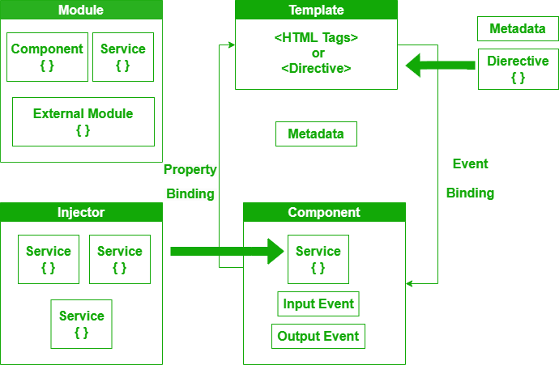
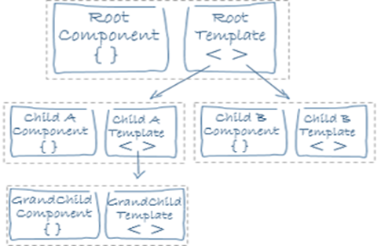
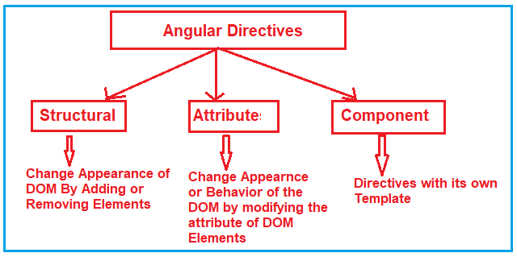
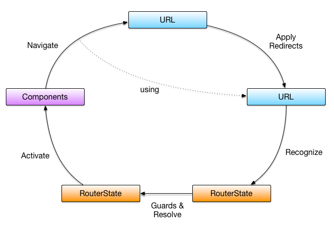
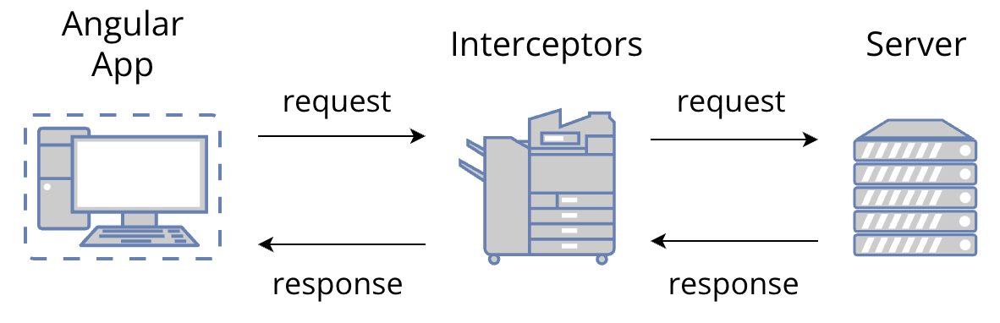

# **ANGULAR**


## Table of Content
- Introduction to AngularJS 
- Getting Started
- Angular Architecture
- Components and Templates
- Directives
- Routing and Navigation
- Forms
- HTTP Client
- Pipes
- Animations
- Testing
- Best Practices
- Common Tasks
- References

## Introduction to AngularJS

### What is Angular?
Angular is a platform and framework for building single-page client applications using HTML and TypeScript. It is maintained by Google and offers a robust structure for developing dynamic web applications.

### Key Features and Advantages
- **Data Binding**: Keeps your data and UI in sync automatically.
- **Component-Based Architecture:** Encapsulates UI functionality within components.
- **Two-Way Data Binding:** Synchronizes data between the model and view automatically.
- **Rich Ecosystem:** Provides tools like Angular CLI, RxJS for reactive programming, and Angular Material for UI components.
- **Directives**: Adds new behaviors to HTML elements.
- **Dependency Injection**: Makes your code easier to understand and test.
- **Routing**: Helps create single-page applications without reloading the entire page.
- **Services**: Reusable components to handle tasks like data fetching.

### Version History
**AngularJS 1.x**: Original version that introduced these features.

**Angular (2+)**: A newer version with improvements in performance and features.

## Getting Started

**Installing AngularJS**

AngularJS can be installed via a CDN or npm.
CDN Installation: Include AngularJS directly in your HTML.
<script src="https://ajax.googleapis.com/ajax/libs/angularjs/1.8.0/angular.min.js"></script>

**npm Installation**: Install AngularJS as a dependency.

**bash**
  ```jsx
    npm install angular@1.8.0
  ```

**Your First AngularJS Application**

Create a basic "Hello World" AngularJS app.
```jsx
    HTML (index.html):
    <!DOCTYPE html>
    <html lang="en" ng-app="myApp">
    <head>
      <meta charset="UTF-8">
      <title>Hello AngularJS</title>
      <script src="https://ajax.googleapis.com/ajax/libs/angularjs/1.8.0/angular.min.js"></script>
    </head>
    <body>
      <div ng-controller="myCtrl">
        <h1>{{ greeting }}</h1>
      </div>
      <script>
        angular.module('myApp', [])
          .controller('myCtrl', function($scope) {
            $scope.greeting = 'Hello, AngularJS!';
          });
      </script>
    </body>
    </html>
```

## AngularJS Architecture
Angular applications are modular and consist of a main module, called the root module, and many feature modules. Each module contains components, services, and other modules.

**Diagram: Angular Architecture**



**Module:**

Modules are used to organize an application into cohesive blocks of functionality.

```jsx
import { NgModule } from '@angular/core';
import { BrowserModule } from '@angular/platform-browser';
import { AppComponent } from './app.component';

@NgModule({
  declarations: [AppComponent],
  imports: [BrowserModule],
  bootstrap: [AppComponent]
})
export class AppModule { }
```
**Components:**

Components are the building blocks of an Angular application.

```jsx
import { Component } from '@angular/core';

@Component({
  selector: 'app-root',
  template: '<h1>{{title}}</h1>',
  styleUrls: ['./app.component.css']
})
export class AppComponent {
  title = 'My First Angular App';
}
```
**Output**

```jsx
My First Angular App
```

## Components and Templates

Components are the basic building blocks of Angular applications. They control a portion of the screen called a view. Components are defined using TypeScript classes and decorated with metadata.

**Diagram: Component Structure**



**Creating Components**

```jsx
ng generate component hello-world
```
This command generates a new component named hello-world.

**Component Templates**

Templates define the view for a component.
```jsx
// hello-world.component.ts
import { Component } from '@angular/core';

@Component({
  selector: 'app-hello-world',
  template: '<p>Hello, World!</p>',
})
export class HelloWorldComponent { }
```

**Output**

```jsx
Hello, World!
```

##  Directives

Directives are special markers in the DOM that tell Angular to do something with the DOM elements and their children. Directives can be classified into three categories: structural, attribute, and custom.

**Diagram: Types of Directives**



**Built-in Directives**

```jsx
//html
<p *ngIf="isVisible">This paragraph is visible.</p>
<button (click)="toggleVisibility()">Toggle Visibility</button>

```
```jsx
//script
// app.component.ts
export class AppComponent {
  isVisible = true;
  toggleVisibility() {
    this.isVisible = !this.isVisible;
  }
}
```
**Output**

```jsx
[Button Click] -> This paragraph is visible. / This paragraph is hidden.

```

## Routing and Navigation

Routing allows navigation between different views or components. Angular Router is a powerful library for managing navigation and URL manipulation.

**Diagram: Angular Routing**



**Setting Up Angular Router**

```jsx
// app-routing.module.ts
import { NgModule } from '@angular/core';
import { RouterModule, Routes } from '@angular/router';
import { HomeComponent } from './home/home.component';
import { AboutComponent } from './about/about.component';

const routes: Routes = [
  { path: 'home', component: HomeComponent },
  { path: 'about', component: AboutComponent },
];

@NgModule({
  imports: [RouterModule.forRoot(routes)],
  exports: [RouterModule]
})
export class AppRoutingModule { }
```
**Output**

```jsx
Navigates to HomeComponent or AboutComponent based on URL.
```

## Forms

Angular forms allow you to handle user input, validation, and submission. There are two types of forms: Template-Driven and Reactive.

**Template-Driven Forms**

Template-driven forms are simpler to use and suitable for simple forms.
```jsx
html
<form #form="ngForm" (ngSubmit)="onSubmit(form)">
  <input name="name" ngModel required>
  <button type="submit">Submit</button>
</form>
```
```jsx
script
export class AppComponent {
  onSubmit(form: any) {
    console.log(form.value);
  }
}
```

**Output**

```jsx
css
{ name: 'Entered Value' }

```
## HTTP Client

The HttpClient module is used to make HTTP requests to a server. It supports modern HTTP features like interceptors, progress events, and request/response transformations.

**Diagram: HTTP Client Flow**



**Making HTTP Requests**

```jsx
import { HttpClient } from '@angular/common/http';

export class AppComponent {
  constructor(private http: HttpClient) {}

  getData() {
    this.http.get('https://api.example.com/data')
      .subscribe(data => {
        console.log(data);
      });
  }
}
```
**Output**

```jsx
Logs data fetched from the API.
```
## Pipes

Pipes transform data in the template. Angular provides built-in pipes for common data transformations like date formatting, currency conversion, and more.

**Using Built-in Pipes**

```jsx
<p>{{ birthday | date }}</p>

```
- **birthday** is a Date object in the component.
- **date** pipe formats the date.

**Output**

```jsx
Displays the formatted date of 'birthday'.

```
## Animations

Animations enhance user experience by adding visual effects to elements. Angular provides a powerful API for creating animations.

**Using Angular Animation APIs**

```jsx
import { trigger, state, style, transition, animate } from '@angular/animations';

@Component({
  selector: 'app-fade-in',
  templateUrl: './fade-in.component.html',
  styleUrls: ['./fade-in.component.css'],
  animations: [
    trigger('fadeInOut', [
      state('void', style({ opacity: 0 })),
      transition(':enter, :leave', [animate(500)])
    ])
  ]
})
export class FadeInComponent { }
```
**Output**

```jsx
Element fades in and out.
```

## Testing

Angular provides tools for unit testing with Jasmine and Karma. Unit testing helps ensure that individual parts of an application work as expected.

**Unit Testing Components**

```jsx
  it('should create the app', () => {
    const fixture = TestBed.createComponent(AppComponent);
    const app = fixture.debugElement.componentInstance;
    expect(app).toBeTruthy();
  });

  it(`should have as title 'My First Angular App'`, () => {
    const fixture = TestBed.createComponent(AppComponent);
    const app = fixture.debugElement.componentInstance;
    expect(app.title).toEqual('My First Angular App');
  });

  it('should render title', () => {
    const fixture = TestBed.createComponent(AppComponent);
    fixture.detectChanges();
    const compiled = fixture.debugElement.nativeElement;
    expect(compiled.querySelector('h1').textContent).toContain('My First Angular App');
  });
});

```

**Output**

```jsx
PASS: should create the app
PASS: should have as title 'My First Angular App'
PASS: should render title
```
##  Best Practices

Following best practices helps ensure that your Angular applications are maintainable, scalable, and robust. Some of the best practices include:

- **Code Organization:** Use feature modules to organize code.

- **Follow Angular Style Guide:** Follow the style guide provided by Angular for consistency and readability.

- **Use Reactive Programming:** Use RxJS for managing asynchronous data streams.

- **Lazy Loading:** Load modules on demand to improve performance.

**Diagram: Angular Application Structure**


**Code Organization Example**

```jsx
// app.module.ts
import { NgModule } from '@angular/core';
import { BrowserModule } from '@angular/platform-browser';
import { AppComponent } from './app.component';
import { CoreModule } from './core/core.module';
import { SharedModule } from './shared/shared.module';
import { FeatureModule } from './feature/feature.module';

@NgModule({
  declarations: [AppComponent],
  imports: [BrowserModule, CoreModule, SharedModule, FeatureModule],
  bootstrap: [AppComponent]
})
export class AppModule { }
```
**Output**

```jsx
A well-organized application that is easier to maintain and extend.
```
## Common Tasks

Common tasks in Angular include internationalization (i18n), state management, performance optimization, and deployment.

**Internationalization (i18n)**

Internationalization allows your app to support multiple languages and locales.

```jsx
import { LOCALE_ID } from '@angular/core';
import { registerLocaleData } from '@angular/common';
import localeFr from '@angular/common/locales/fr';

registerLocaleData(localeFr);

@NgModule({
  providers: [{ provide: LOCALE_ID, useValue: 'fr-FR' }]
})
export class AppModule { }
```

**Output**

```jsx
Angular application supports French (France) locale.
```
## References

https://angular.dev/overview

https://docs.angularjs.org/guide

https://www.geeksforgeeks.org/angularjs/
